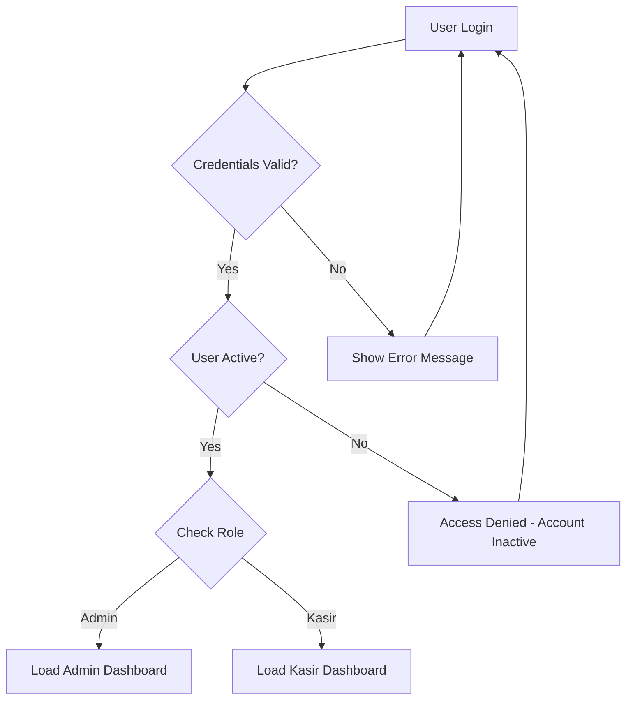
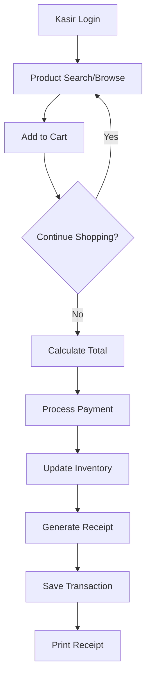
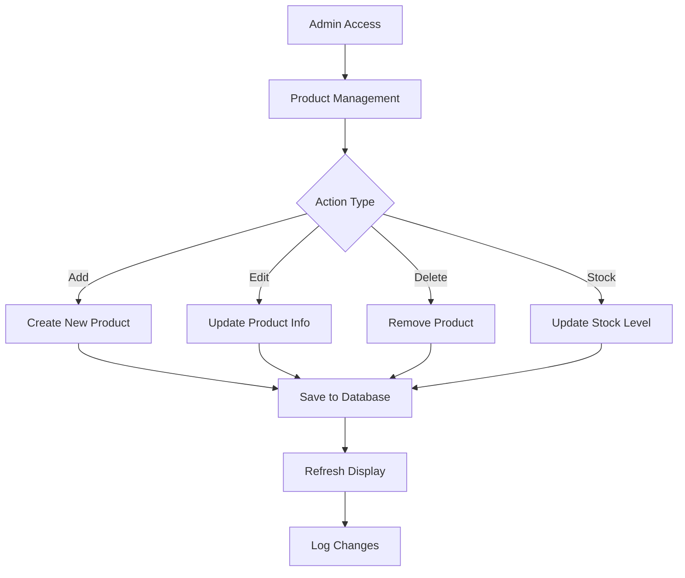

# Final Proyek Pemrograman Berorientasi Obyek 2

<ul>
  <li>Mata Kuliah: Pemrograman Berorientasi Obyek 2</li>
  <li>Dosen Pengampu: <a href="https://github.com/Muhammad-Ikhwan-Fathulloh">Muhammad Ikhwan Fathulloh</a></li>
</ul>

## Profil

<ul>
  <li>Nama: {Bayu Aji Prayoga}</li>
  <li>NIM: {23552011194}</li>
  <li>Studi Kasus: {Aplikasi KASIRIN Berbasis GUI untuk Digitalisasi Warung Mamah Arika (NusaMart)}</li>
</ul>

## Kelompok

<ul>
  <li>Kelompok: 2</li>
  <li>Proyek: Sistem Point of Sale (POS) untuk Warung Mamah Arika(NusaMart)</li>
  <li>Anggota:</li>
  <ul>
    <li>Ketua: <a href="https://github.com/BayuAjiPrayoga">Bayu Aji Prayoga</a></li>
    <li>Anggota 1: <a href="https://github.com/">Arika Azhar</a></li>
    <li>Anggota 2: <a href="https://github.com/">Havid Restu Aviyantara</a></li>
  </ul>
</ul>

## Judul Studi Kasus

<p>
  Optimalisasi Manajemen Stok dan Transaksi Warung Mamah Arika Melalui Implementasi Aplikasi Kasir KASIRIN Berbasis GUI
</p>

## Penjelasan Studi Kasus

<p>
  Warung Mamah Arika, sebuah usaha ritel skala kecil yang berlokasi di Bandung, saat ini masih mengandalkan metode konvensional dalam pengelolaan operasionalnya. Pencatatan transaksi penjualan, inventarisasi stok barang, hingga rekapitulasi keuangan harian masih dilakukan secara manual menggunakan kertas dan pulpen. Metode ini rentan terhadap kesalahan manusia, memakan waktu, dan menyulitkan pemilik warung dalam memantau kondisi stok secara real-time serta menganalisis performa penjualan secara akurat.
</p>
<p>
  Studi kasus ini berfokus pada pengembangan dan implementasi sebuah aplikasi kasir bernama KASIRIN berbasis antarmuka grafis pengguna (GUI) menggunakan NetBeans IDE. Aplikasi KASIRIN dirancang untuk menggantikan sistem pencatatan manual di Warung Mamah Arika, dengan fitur-fitur utama meliputi pencatatan penjualan yang efisien, manajemen data produk (harga, stok), serta pelaporan transaksi sederhana. Diharapkan, dengan adanya aplikasi KASIRIN, Warung Mamah Arika dapat meningkatkan akurasi data, efisiensi operasional, dan memberikan kemudahan bagi pemilik dalam pengambilan keputusan bisnis. Implementasi solusi digital ini juga bertujuan untuk memposisikan Warung Mamah Arika sebagai contoh transformasi UMKM tradisional menuju era digital.
</p>

## Penjelasan 4 Pilar OOP dalam Studi Kasus

### 1. Inheritance (Pewarisan)

**Apa itu Inheritance?**
Inheritance seperti anak yang mewarisi sifat dari orangtuanya. Dalam pemrograman, class anak bisa menggunakan semua properti dan method dari class induknya.

**Contoh Sederhana dalam Proyek KASIRIN:**

Bayangkan kita punya **class Induk** bernama `BaseEntity`:

```java
public abstract class BaseEntity {
    protected int id;                    // ID unik untuk setiap data
    protected LocalDateTime createdAt;   // Kapan data dibuat
    protected LocalDateTime updatedAt;   // Kapan terakhir diubah
    protected boolean isActive;          // Apakah data masih aktif

    // Method yang sama untuk semua anak
    public void markAsUpdated() {
        this.updatedAt = LocalDateTime.now();
    }
}
```

**Class Anak** yang mewarisi dari BaseEntity:

```java
// User mewarisi semua properti dari BaseEntity
public class User extends BaseEntity {
    private String username;  // Properti khusus User
    private String password;
    private String role;
    // User otomatis punya id, createdAt, updatedAt, isActive dari BaseEntity!
}

// Barang juga mewarisi dari BaseEntity
public class Barang extends BaseEntity {
    private String namaBarang;  // Properti khusus Barang
    private int stok;
    private double harga;
    // Barang juga otomatis punya id, createdAt, updatedAt, isActive!
}
```

**Keuntungan Inheritance:**

- **Tidak perlu nulis ulang kode yang sama** - semua class anak otomatis punya properti dasar
- **Konsisten** - semua data punya struktur yang sama
- **Mudah maintenance** - kalau mau ubah sesuatu di BaseEntity, semua anak ikut berubah

### 2. Encapsulation (Enkapsulasi)

**Apa itu Encapsulation?**
Encapsulation seperti brankas yang melindungi data penting. Data disembunyikan dan hanya bisa diakses melalui cara yang aman.

**Contoh Sederhana dalam Proyek KASIRIN:**

```java
public class Barang extends BaseEntity {
    // Data ini PRIVATE - tidak bisa diakses langsung dari luar
    private String namaBarang;    // Disembunyikan agar aman
    private int stok;            // Tidak bisa diubah sembarangan
    private double harga;        // Harus melalui validation

    // Method PUBLIC untuk akses data dengan aman
    public int getStok() {
        return stok;  // Baca data boleh
    }

    public void setStok(int stokBaru) {
        if (stokBaru >= 0) {           // Validasi: stok tidak boleh minus
            this.stok = stokBaru;
            markAsUpdated();           // Update waktu perubahan
        } else {
            System.out.println("Stok tidak boleh negatif!");
        }
    }

    // Method untuk kurangi stok saat ada transaksi
    public void kurangiStok(int jumlah) {
        if (stok >= jumlah) {          // Cek dulu apakah stok cukup
            this.stok -= jumlah;
            markAsUpdated();
        } else {
            throw new IllegalArgumentException("Stok tidak mencukupi!");
        }
    }
}
```

**Kenapa Encapsulation Penting:**

- **Melindungi data** - tidak ada yang bisa merusak data secara tidak sengaja
- **Ada validasi** - setiap perubahan data dicek dulu apakah valid
- **Kontrol akses** - bisa atur siapa yang boleh ubah data

### 3. Polymorphism (Polimorfisme)

**Apa itu Polymorphism?**
Polymorphism seperti remote control yang sama bisa dipake untuk berbagai merk TV, tapi cara kerjanya beda-beda. Satu method yang sama, tapi perilakunya beda tergantung objectnya.

**Contoh Sederhana dalam Proyek KASIRIN:**

```java
// Method yang sama di BaseEntity, tapi implementasinya beda
public abstract class BaseEntity {
    public abstract boolean isValid();        // Setiap class anak harus buat method ini
    public abstract String getDisplayName();  // Tapi cara implementasinya beda-beda
}

// User punya cara validasi sendiri
public class User extends BaseEntity {
    @Override
    public boolean isValid() {
        // Validasi khusus untuk User
        return username != null && !username.isEmpty() &&
               password != null && !password.isEmpty();
    }

    @Override
    public String getDisplayName() {
        return "User: " + username;  // Format display khusus User
    }
}

// Barang punya cara validasi yang berbeda
public class Barang extends BaseEntity {
    @Override
    public boolean isValid() {
        // Validasi khusus untuk Barang
        return namaBarang != null && !namaBarang.isEmpty() &&
               stok >= 0 && harga > 0;
    }

    @Override
    public String getDisplayName() {
        return "Produk: " + namaBarang;  // Format display khusus Barang
    }
}
```

**Polymorphism dalam Action:**

```java
// Satu method bisa handle berbagai jenis object
public void tampilkanInfo(BaseEntity entity) {
    if (entity.isValid()) {                    // Method sama, tapi behavior beda
        System.out.println(entity.getDisplayName());  // Tampilan beda-beda
    } else {
        System.out.println("Data tidak valid!");
    }
}

// Bisa dipanggil dengan User atau Barang
tampilkanInfo(new User());    // Output: "User: admin"
tampilkanInfo(new Barang());  // Output: "Produk: Indomie"
```

**Keuntungan Polymorphism:**

- **Fleksibel** - satu method bisa handle banyak jenis object
- **Mudah extend** - bisa tambah class baru tanpa ubah code yang udah ada
- **Code reuse** - method yang sama bisa dipake berkali-kali

### 4. Abstraction (Abstraksi)

**Apa itu Abstraction?**
Abstraction seperti menggunakan mobil tanpa perlu tahu cara kerja mesinnya. Kita cuma perlu tahu cara nyetir, tanpa perlu tahu detail teknis di dalamnya.

**Contoh Sederhana dalam Proyek KASIRIN:**

```java
// Abstract class - seperti "blueprint" yang belum lengkap
public abstract class BaseController<T extends BaseEntity> {

    // Method lengkap yang bisa langsung dipake
    public final boolean simpanData(T data) {
        System.out.println("Mulai menyimpan data...");

        if (!data.isValid()) {           // Cek validasi dulu
            System.out.println("Data tidak valid!");
            return false;
        }

        boolean berhasil = lakukanPenyimpanan(data);  // Method abstrak - harus diisi subclass

        if (berhasil) {
            System.out.println("Data berhasil disimpan!");
        } else {
            System.out.println("Gagal menyimpan data!");
        }

        return berhasil;
    }

    // Method abstrak - subclass HARUS mengisi cara kerjanya
    protected abstract boolean lakukanPenyimpanan(T data);
}

// Implementasi konkret untuk User
public class UserController extends BaseController<User> {
    @Override
    protected boolean lakukanPenyimpanan(User user) {
        // Cara khusus menyimpan User ke database
        try {
            // ... kode untuk simpan ke tabel users
            return true;
        } catch (Exception e) {
            return false;
        }
    }
}

// Implementasi konkret untuk Barang
public class BarangController extends BaseController<Barang> {
    @Override
    protected boolean lakukanPenyimpanan(Barang barang) {
        // Cara khusus menyimpan Barang ke database
        try {
            // ... kode untuk simpan ke tabel barang
            return true;
        } catch (Exception e) {
            return false;
        }
    }
}
```

**Interface - Kontrak yang Harus Dipenuhi:**

```java
// Interface seperti "kontrak" - siapa yang implement harus penuhi semua method
public interface Exportable {
    void exportToCSV(String filePath);    // Harus bisa export ke CSV
    void exportToPDF(String filePath);    // Harus bisa export ke PDF
}

// Barang mengimplementasi interface ini
public class Barang extends BaseEntity implements Exportable {
    @Override
    public void exportToCSV(String filePath) {
        // Cara khusus Barang di-export ke CSV
        System.out.println("Mengexport barang ke: " + filePath);
    }

    @Override
    public void exportToPDF(String filePath) {
        // Cara khusus Barang di-export ke PDF
        System.out.println("Mengexport barang ke PDF: " + filePath);
    }
}
```

**Keuntungan Abstraction:**

- **Sederhana** - tidak perlu pusing dengan detail teknis
- **Mudah ganti-ganti** - bisa ganti implementasi tanpa ganggu yang lain
- **Jelas strukturnya** - ada aturan yang harus diikuti semua class
- **Focus pada yang penting** - cukup tahu cara pakainya, tidak perlu tahu cara kerjanya

---

## **Ringkasan Sederhana:**

1. **Inheritance** = Anak mewarisi sifat orangtua (class anak dapat properti class induk)
2. **Encapsulation** = Data dilindungi dalam brankas (private fields + public methods)
3. **Polymorphism** = Satu remote untuk banyak TV (method sama, behavior beda)
4. **Abstraction** = Nyetir mobil tanpa tahu cara kerja mesin (pakai tanpa tahu detail)

Keempat pilar ini bekerja sama membuat aplikasi KASIRIN jadi lebih **rapi**, **aman**, **mudah dikembangkan**, dan **mudah dipelihara**!

## Demo Proyek

<ul>
  <li>Github: <a href="https://github.com/BayuAjiPrayoga/UAS_PBO2_TIF-RP-23-CNS-A_KELOMPOK-2">Github</a></li>
  <li>Youtube: <a href="">Youtube</a></li>
</ul>

## Schema Database

### Struktur Database: `ngawarung`

Database KASIRIN menggunakan MySQL 8.0.30 dengan 3 tabel utama yang saling berelasi untuk mendukung operasional Point of Sale System.

#### Tabel 1: `users`

Mengelola data pengguna sistem dengan role-based access control.

```sql
CREATE TABLE `users` (
  `id` int NOT NULL AUTO_INCREMENT,
  `username` varchar(50) NOT NULL,
  `password` varchar(255) NOT NULL,
  `role` enum('admin','kasir') NOT NULL,
  `is_active` tinyint(1) DEFAULT '1',
  PRIMARY KEY (`id`),
  UNIQUE KEY `username` (`username`)
) ENGINE=InnoDB DEFAULT CHARSET=utf8mb4;
```

**Kolom:**

- `id`: Primary key auto increment
- `username`: Username unik untuk login
- `password`: Password (dalam implementasi nyata harus di-hash)
- `role`: Role pengguna (admin/kasir)
- `is_active`: Status aktif user (1=aktif, 0=non-aktif)

#### Tabel 2: `barang`

Menyimpan data produk yang dijual di warung.

```sql
CREATE TABLE `barang` (
  `id` int NOT NULL AUTO_INCREMENT,
  `nama_barang` varchar(100) NOT NULL,
  `stok` int NOT NULL DEFAULT '0',
  `harga` decimal(10,2) NOT NULL,
  `kategori` varchar(50) NOT NULL DEFAULT 'Umum',
  PRIMARY KEY (`id`)
) ENGINE=InnoDB DEFAULT CHARSET=utf8mb4;
```

**Kolom:**

- `id`: Primary key auto increment
- `nama_barang`: Nama produk (max 100 karakter)
- `stok`: Jumlah stok tersedia
- `harga`: Harga produk (decimal 10,2)
- `kategori`: Kategori produk untuk klasifikasi

#### Tabel 3: `transaksi`

Mencatat semua transaksi penjualan yang terjadi.

```sql
CREATE TABLE `transaksi` (
  `id` int NOT NULL AUTO_INCREMENT,
  `id_barang` int NOT NULL,
  `id_kasir` int NOT NULL,
  `jumlah` int NOT NULL,
  `total_harga` decimal(10,2) NOT NULL,
  `waktu` datetime DEFAULT CURRENT_TIMESTAMP,
  PRIMARY KEY (`id`),
  KEY `id_barang` (`id_barang`),
  KEY `id_kasir` (`id_kasir`),
  CONSTRAINT `transaksi_ibfk_1` FOREIGN KEY (`id_barang`) REFERENCES `barang` (`id`),
  CONSTRAINT `transaksi_ibfk_2` FOREIGN KEY (`id_kasir`) REFERENCES `users` (`id`)
) ENGINE=InnoDB DEFAULT CHARSET=utf8mb4;
```

**Kolom:**

- `id`: Primary key auto increment
- `id_barang`: Foreign key ke tabel barang
- `id_kasir`: Foreign key ke tabel users
- `jumlah`: Jumlah barang yang dibeli
- `total_harga`: Total harga transaksi
- `waktu`: Timestamp transaksi (auto current timestamp)

### Entity Relationship Diagram (ERD)

```
┌─────────────────┐       ┌─────────────────┐       ┌─────────────────┐
│      users      │       │   transaksi     │       │     barang      │
├─────────────────┤       ├─────────────────┤       ├─────────────────┤
│ 🔑 id (PK)      │◄─────►│ 🔑 id (PK)      │◄─────►│ 🔑 id (PK)      │
│    username     │   1:N │ 🔗 id_kasir(FK) │  N:1  │    nama_barang  │
│    password     │       │ 🔗 id_barang(FK)│       │    stok         │
│    role         │       │    jumlah       │       │    harga        │
│    is_active    │       │    total_harga  │       │    kategori     │
└─────────────────┘       │    waktu        │       └─────────────────┘
                          └─────────────────┘
```

## Konsep dan Arsitektur Sistem

### Paradigma Object-Oriented Programming

### Design Patterns Implementation

#### 1. **Template Method Pattern**

Digunakan dalam BaseController untuk standardisasi operasi CRUD dengan allowing customization di subclass.

#### 2. **Strategy Pattern**

Implementasi multiple search algorithms:

```java
public interface SearchStrategy<T> {
    List<T> search(List<T> items, String criteria);
}

// Concrete strategies
- NameSearchStrategy
- CategorySearchStrategy
- PriceRangeSearchStrategy
```

#### 3. **Observer Pattern**

Untuk event handling dan audit trail:

```java
public interface EntityObserver {
    void onEntityCreated(BaseEntity entity);
    void onEntityUpdated(BaseEntity entity);
    void onEntityDeleted(BaseEntity entity);
}
```

#### 4. **Factory Pattern**

Untuk object creation dan dependency injection:

```java
public class EntityFactory {
    public static BaseEntity createEntity(String type, Object... params);
}
```

## Aktor pada Sistem

### 1. **Administrator (Admin)**

**Tanggung Jawab:**

- Akses penuh ke sistem dan konfigurasi
- Mengelola pengguna (tambah, edit, hapus, aktifkan/non-aktifkan)
- Mengelola produk dan kategori
- Memantau dan menyetujui transaksi
- Membuat laporan sistem dan analisis
- Backup dan pemeliharaan database

**Fitur yang Bisa Diakses:**

- Mengelola akun pengguna (kasir) - buat, edit, hapus, aktifkan/matikan
- Mengatur produk dan kategori barang
- Memantau semua transaksi yang terjadi
- Membuat laporan lengkap (penjualan, stok, keuangan)

### 2. **Kasir (Cashier)**

**Tanggung Jawab:**

- Memproses transaksi pelanggan
- Mencari dan melihat produk
- Mengelola keranjang belanja
- Memproses pembayaran
- Mencetak struk belanja
- Terbatas hanya pada tugas operasional

**Fitur yang Bisa Diakses:**

- Melakukan scanning/input produk ke keranjang
- Menghitung total pembelian secara otomatis
- Memproses pembayaran dari pelanggan
- Mencetak struk untuk pelanggan
- Melihat riwayat transaksi pribadi
- Mencari produk berdasarkan nama atau kategori

### 3. **Pelanggan (Customer)**

**Interaksi dengan Sistem:**

- Menerima struk dari transaksi pembelian
- Mendapat manfaat dari proses transaksi yang efisien
- Melihat detail produk yang dibeli di struk

**Pengalaman Pelanggan:**

- Transaksi lebih cepat dengan sistem digital
- Struk yang jelas dan mudah dibaca
- Tidak ada kesalahan perhitungan manual
- Waktu antrian yang lebih singkat

## Alur Sistem

### 1. **Authentication Flow**



### 2. **Transaction Processing Flow**



### 3. **Inventory Management Flow**



## Rencana Fitur

### Phase 1: Core Features (Completed)

1. **User Authentication & Authorization**

   - Secure login system
   - Role-based access control
   - User status management (active/inactive)

2. **Product Management**

   - CRUD operations untuk produk
   - Category management
   - Stock level monitoring
   - Price management

3. **Transaction Processing**

   - Shopping cart functionality
   - Real-time calculation (subtotal, tax, total)
   - Payment processing
   - Receipt generation
   - **Audio feedback system** (payment success, notifications, errors)

4. **Basic Reporting**
   - Transaction history
   - Stock reports
   - User activity logs

## Rencana Implementasi

### Technology Stack

- **Backend:** Java 17 with OOP principles
- **Frontend:** JavaFX 13 for rich desktop UI
- **Database:** MySQL 8.0.30 for data persistence
- **Build Tool:** Maven for dependency management
- **Version Control:** Git for source code management

## Team & Acknowledgments

### Development Team

- **Lead Developer:** Bayu Aji Prayoga
- **Database Designer:** Havid Restu Avyantara
- **UI/UX Designer:** Arika Azhar

**© 2025 KASIRIN Project - Tugas Besar Pemrograman Berorientasi Objek**  
_Universitas Teknologi Bandung - Fakultas Industri Kreatif_

## Support & Contact

Untuk pertanyaan, bug reports, atau feature requests:

- **Email**: bayu_wanderlust@gmail.com
- **Documentation**: This README.md

**© 2025 KASIRIN - NusaMart Point of Sale System**  
_Built with love and Java_
